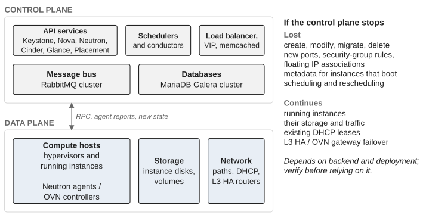

*Part I — Understanding the Problem*

# Chapter 1 — OpenStack Doesn’t End at Deployment

A deployment project has a natural ending. The infrastructure is ready, the OpenStack services are deployed, validation is complete, documentation is delivered, and the project team moves on to its next objective. Production does not share that boundary. Once workloads depend on OpenStack, the organization enters a phase in which the platform is a permanent operational capability, and that phase has no end date. Practitioners call it Day 2: everything that happens after the platform has been built (Day 1) and is carrying workloads that matter. This book uses the term in that sense throughout.

The transition into Day 2 is routinely underestimated, and it tends to fail in a recognizable way. The engineers who built the platform remain responsible for incidents, changes and support because they know the architecture best, so they become the default escalation point for everything. The organization believes it has created an operating model when in fact it has extended the deployment team into production. Experts are expensive and scarce, and their time is needed for architecture, upgrades and difficult engineering decisions; instead it is consumed by repetitive support. Meanwhile the wider operations organization never develops OpenStack capability, because the experts remain the only people trusted to intervene.

The way out is to distribute operational work according to risk rather than to remove experts from operations. Routine, well-understood, reversible actions can progressively move toward first-line operations, the team that receives user reports and handles known situations from procedures; complex diagnosis and platform changes remain with the specialized team. The boundary should be drawn by consequence and required expertise, not by organizational convenience. A useful test for any operation is whether it requires platform expertise or a reliable procedure. A read-only diagnostic that can be performed safely from a documented procedure should not need the most experienced OpenStack engineer in the company, and every such operation that moves toward first-line support creates capacity where it is scarcest.

## Two lifecycles, one platform

The platform has two intertwined lifecycles. The **delivery lifecycle** covers features, upgrades, integrations, architecture and improvements. The **operational lifecycle** covers incidents, maintenance, patching, capacity, recovery, monitoring and support. They are two dimensions of the same platform, and each fails without the other: a team that delivers continuously without operational capacity eventually creates instability, and a team that only protects the existing state eventually creates an ageing platform that nobody dares to touch. Day 2 requires an explicit balance between them, decided rather than left to whoever shouts loudest.

The tension between the two usually comes from incompatible local objectives. Delivery wants to introduce capability; operations, which many organizations call RUN, wants to preserve service quality. Both are legitimate, and the trouble begins when they are treated as separate systems. A production OpenStack platform cannot be divided into “the part we change” and “the part we operate”: a change to Nova becomes an operational concern, a recurring operational problem becomes an architectural concern, a security requirement becomes a capacity problem, an incident reveals a missing product capability. The practical answer is to give both sides a shared view of consequences. A proposed change should answer at least four questions: what capability does it create or protect, what existing capability could it affect, what operational burden does it add, and what will be required to operate it after the delivery team has moved on. This matters in OpenStack because service boundaries are not business boundaries. A change that appears local to Nova may reach Placement, Neutron, the message bus, the database, the hypervisors and the consumers’ own workflows.

## Day 2 is a platform in motion

Day 2 is often reduced to keeping services running, and that definition is too narrow, because an OpenStack platform is never still. Workloads change, capacity changes, releases age, security requirements evolve, hardware is replaced, dependencies are patched, consumers request new capabilities and teams change. The platform has to operate *while* changing, which is a different problem from operating a static system. Operations, in this sense, is the capability that allows change to happen without destroying the trusted state on which the business depends, and a useful way to hold both ideas together is to distinguish **protecting the current state** from **creating the next state**. Both are necessary, and they compete for the same people, the same maintenance windows and the same capacity.

Production also changes the rules of engineering. In a laboratory, an engineer can rebuild an environment to understand it. In production, the existing state contains business-critical workloads and history that cannot simply be discarded, so a change must be judged not only on whether it works but on whether it can be recovered. And every change consumes a finite resource. Maintenance windows are finite. Engineers are finite. Compute capacity for live migration, the operation that moves a running instance from one hypervisor to another, is finite. The attention available for incidents, upgrades and documentation is finite. This book calls that resource **change capacity**, and treats it as a real constraint rather than a planning inconvenience: maintenance windows compete with upgrades, security work competes with feature delivery, recovery exercises compete with incident response, and engineers cannot execute an unlimited number of changes simply because the backlog contains them. This creates a discipline I consider one of the most valuable in Day 2 work: prioritize the changes that improve the platform’s ability to absorb future changes. A simplification that removes a recurring operational burden may be worth more than another feature. A recovery exercise may have more long-term value than a low-risk optimization. Reducing local divergence from upstream may make the next upgrade materially safer.

The cost of a change, moreover, has little to do with the number of commands it takes. A maintenance operation may be routine from a technical perspective and still consume real change capacity. A security patch may require live migrations. A networking modification may affect several services at once. An upgrade may require changes outside OpenStack entirely. What determines the cost is blast radius (how much of the platform and how many workloads a failure of the change would reach), uncertainty, recoverability, dependencies, business criticality and the capacity available at the time.

## Controlled degradation

Stability must not be confused with freezing the platform. Known states are the foundation of safe change: when engineers understand what a healthy environment looks like, deviations become detectable, and when recovery procedures have been tested against a known state, incident response depends less on improvisation. This book calls such a state a **trusted state**: one whose behaviour, dependencies and recovery characteristics are known well enough to be relied upon.

Controlled degradation follows from the same idea, and OpenStack’s architecture gives it an unusually solid basis. Suppose the control plane becomes unstable. The organization can decide to stop accepting new resource operations while protecting the workloads that already run. That is often preferable to letting an unstable control plane keep accepting requests that make recovery harder. The business does not need every capability available at every moment; it needs the capabilities that matter most to remain protected.

> **Technical note — the control plane and the data plane fail separately.** In OpenStack, the control plane (the API services, schedulers, conductors, the message bus and the databases) is distinct from the data plane (the hypervisors running the virtual machines, their disks and their network paths). If the API services, the message bus or the databases are stopped or degraded, existing instances continue to run, keep their storage and keep exchanging traffic. What is lost is the ability to create, modify, migrate or delete resources, and the propagation of *new* state to the data plane: a new port, a changed security-group rule or a newly associated floating IP will not take effect until the control plane returns, and an instance that boots during the outage may fail to reach the metadata service. Functions that are implemented on the data-plane nodes themselves generally survive: with the common ML2/OVS setup, existing DHCP leases keep being served by the DHCP agent’s dnsmasq as long as its host runs, and with OVN, DHCP is answered locally on each compute; router failover with L3 HA (keepalived) or OVN gateway chassis is a data-plane mechanism that does not need the API. Two cautions follow. Neutron agents and the OVN controllers run *on* the data-plane nodes, so restarting some of them, depending on version and configuration, can interrupt traffic briefly; “stopping the control plane” should mean the APIs, the bus and the databases, not the agents. And the exact behaviour depends on the networking backend and the deployment, and should be verified for each platform before it is relied upon in an incident. See the Nova architecture documentation and the Neutron documentation on agents and OVN.

This separation (Figure 1.1) is what makes “stop the APIs, protect the running workloads” a credible option rather than a euphemism for an outage. Chapter 19 shows it used in an incident.

Two virtual machines can look identical to the infrastructure while their business consequences are completely different. The organization therefore needs a way to translate technical state into business criticality, and it needs that translation *before* the incident. Chapter 20 shows what happens when it is missing during a patching campaign.

*Figure 1.1: The control plane and the data plane fail separately: what stops and what continues when the API services, the message bus and the databases are unavailable.*

## Stability has a capacity cost

If all engineering capacity is consumed by incidents and urgent maintenance, the organization stops documenting, training, testing recovery and reducing debt. The platform may remain operational while becoming less sustainable every month. Stability is an organizational capability as much as an infrastructure property, and a platform that requires permanent heroics to remain stable is not stable at all.

The temptation to fix everything also needs to be resisted. Not every issue deserves immediate remediation. Some technical debt is known and controlled; some low-impact imperfections are cheaper to carry than to remove; some transformations create more risk than the problem they were meant to solve. The question to ask about any improvement is whether making it *now* reduces more risk than it introduces.

## The handover is a capability transition

The move from deployment to operations should be treated as a transfer of capability, not a project milestone. The deployment team may know why a particular RabbitMQ topology was chosen, why database behaviour is monitored in a particular way, why certain Nova settings are deliberately constrained, or why one network dependency is considered critical. None of that knowledge is transferred because a runbook exists. The harder question a handover must answer is whether the receiving organization can make a safe decision without the deployment team present.

That includes routine decisions as well as incidents. The operations team should know which symptoms can be handled locally, which require escalation, what evidence must be collected before escalating, and which actions are explicitly prohibited. The platform engineers should remain available for difficult problems, but as an escalation capability, not as the operating model itself. At scale the point becomes unavoidable: a platform serving hundreds or thousands of workloads cannot be operated by treating every event as an expert consultation. It needs a graduated model in which routine signals are filtered, common actions are standardized and scarce expertise is reserved for the situations where it adds disproportionate value.

The first operational model does not need to be perfect, but it needs to exist before the first day of production. The organization should know which team receives a user report, which team can inspect the platform, which actions are routine, which require specialist intervention, and who can authorize disruptive recovery. This matters in OpenStack because apparent ownership is misleading: a platform team may own Nova while another team owns the hypervisors, another the network fabric and another the database infrastructure. An incident does not respect those boundaries, so the operating model needs an explicit path across them. A simple rehearsal exposes whether it exists. A user cannot create a virtual machine. Who receives the request? What evidence is collected? Which services are checked? Who investigates Placement or Neutron? Who decides whether an API should be restricted? Who talks to the consumer? If those questions produce different answers depending on who happens to be available, the platform is not operationally ready, whatever the acceptance tests say.

“Everything is green” is not a useful definition of a healthy OpenStack platform either. A deployment can pass its acceptance tests while the organization remains unprepared for production: a service can start correctly without anyone knowing how it behaves under load, a migration can succeed without there being capacity for a full maintenance event, a feature can work without a documented recovery procedure. The organization should know what trusted operation means for its critical capabilities, such as VM provisioning, tenant connectivity, volume operations, authentication, workload migration and recovery. Without those definitions, stability is a collection of health checks rather than a business-relevant condition. This is also why the future operators should be involved before the end of Day 1: they need visibility into the design, not merely a handover package, and they need to know which of the designers’ assumptions are important enough to become operational constraints.

## The deployment team should not become a permanent dependency

The strongest deployment teams create their own operational risk precisely because they are good. They know the architecture better than anyone, they solve incidents quickly, and they remember the reasons behind unusual decisions, so the organization becomes reluctant to transfer responsibility away from them. This is understandable and dangerous. The purpose of expertise should be to make the organization less dependent on that expertise for routine operation, while experts remain available for high-consequence decisions and difficult engineering problems.

> **Principle.** The measure of a successful deployment is whether the platform remains operable when the deployment experts are no longer present.

Deployment is where the organization’s long-term responsibility for the platform begins, and the first operational objective is to build an organization capable of operating what has already been built.

---

[← Introduction](00-introduction.md) · [Contents](../README.md) · [Chapter 2 — The Enemy Is Loss of Control →](02-the-enemy-is-loss-of-control.md)
