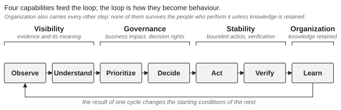

*Part I — Understanding the Problem*

# Chapter 4 — The Control Loop

The four capabilities become operational behaviour through a loop that connects activities most organizations already perform:

**Observe** → **Understand** → **Prioritize** → **Decide** → **Act** → **Verify** → **Learn**

Readers who know the plan–do–check–act cycle or the observe–orient–decide–act loop will recognize the shape; the loop makes no claim to novelty. Its value in this book is that it names the step most often skipped on a platform under pressure, and that it shows where each of the four capabilities does its work (Figure 4.1).

*Figure 4.1: The four capabilities and the steps of the control loop they feed.*

OpenStack produces many signals, and a failed VM creation may involve several services and dependencies at once. Visibility provides evidence, but evidence is not understanding. Understanding identifies the meaningful hypotheses and constraints. Prioritization introduces business impact. Decision rights, the explicit authority to make a decision and accept its consequence, determine who chooses among the options. Action must remain within understood boundaries. Verification determines whether the intended outcome was achieved, because technical success is not service success: a successful live migration does not prove that the performance problem it was meant to solve has gone away. Learning converts the result into organizational capability.

## The loop operates at several timescales

Operations use it continuously. Change management uses it during controlled transitions. Evolution uses it across lifecycle periods measured in years. An operations engineer may discover a recurring issue today; the platform team addresses it in the next maintenance cycle; architecture removes the underlying dependency at the next upgrade. These are different timescales of the same loop, and the value of the framework comes from connecting them. The loop is also a feedback system: a failed recovery improves documentation, a recurring incident changes observability, a difficult upgrade motivates simplification, a team change reveals a knowledge dependency. Without that feedback the organization repeatedly solves symptoms.

## Where the loop breaks

When control weakens, the broken step is usually visible: observing without understanding, understanding without deciding, deciding without the capacity to act, acting without verifying, learning without retaining. The last is the quietest failure. Learning that stays with the people involved disappears when they leave, so the loop must end in something retained: documentation, ownership, training, measurement or a change to the platform. That is what makes it organizational rather than procedural.

## The loop is for ambiguous situations

A routine request moves from observation to action in minutes and needs no ceremony. The loop earns its place when the answer is not obvious. An initial signal suggests a Nova problem; investigation reveals messaging anomalies; further evidence shows the database is affected too; the business impact changes because existing workloads remain available while new provisioning is blocked. The decision is no longer “fix Nova”. It becomes “protect the trusted platform state while accepting a temporary loss of provisioning capability”, and the loop is what allows the organization to change its decision as the evidence changes. Chapter 19 follows a sequence very like this one through a real incident.

The loop must therefore work at human speed. A framework becomes useless if it requires a meeting for every decision. It should be lightweight for routine work and increasingly explicit as consequence and uncertainty grow; that proportionality is what separates control from bureaucracy. Learning, in turn, must change something: an incident review that produces only a report has little value. If nothing changes after an incident, the organization should be able to explain why the existing controls were already sufficient.

Control also requires capacity: when incidents and maintenance consume all available engineering time, the loop quietly loses its last two steps. A mature OpenStack organization has not eliminated unexpected behaviour. It is one in which engineers can investigate without guesswork, decisions have clear owners, changes execute within understood boundaries, and operational knowledge outlives the individuals who acquired it.

---

[← Chapter 3 — Why Good Platforms Become Difficult to Operate](03-why-good-platforms-become-difficult-to-operate.md) · [Contents](../README.md) · [Chapter 5 — Assessing Platform Control →](05-assessing-platform-control.md)
