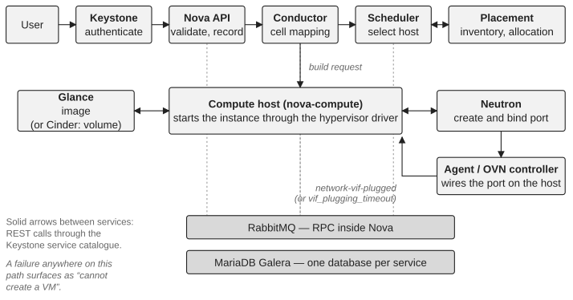

*Part II — Assessing Control*

# Chapter 5 — Assessing Platform Control

Before changing a difficult OpenStack environment, the organization needs to know where it stands. The assessment should begin with what the business depends on, not with the component list. A useful chain follows the consequence of failure through the platform:

**Business capability** → **OpenStack capability** → **Platform service** → **Technical dependency** → **Team** → **Expertise** → **Recovery capability**

A business capability depends, say, on VM provisioning. That capability involves Nova and Placement, but also Keystone, Glance, Neutron, the message bus, the databases, storage and the underlying infrastructure. It is then necessary to identify who owns each dependency, who can diagnose it and who can recover it. Business impact comes first: a highly complex component supporting a non-critical capability may need less immediate attention than a simple dependency supporting a critical workload.

> **Technical note — what a VM creation actually traverses.** A request to create a server is authenticated by Keystone and received by the Nova API, which validates it, records the request in the API database and hands the build to the conductor, the Nova service that coordinates multi-step operations and mediates database access for the computes. The scheduler selects a host, using Placement to find resource providers with the required inventory and to claim the allocation. Every deployment has at least one cell (Nova cells v2), and the conductor maps the instance to the cell whose database will hold it; a host that exists but has not been mapped to a cell with `nova-manage cell_v2 discover_hosts` fails builds with “host is not mapped to any cell”, a classic cause of “capacity exists but nothing lands on it”. The selected compute service retrieves the image from Glance (or, for boot-from-volume, asks Cinder for the volume), asks Neutron to create and bind the port, and instructs the hypervisor driver to start the instance. Port binding is the step where Neutron’s mechanism driver and the agent or OVN controller on the compute wire the port; Nova then waits for Neutron’s `network-vif-plugged` event before finishing the boot, and an instance that sits in BUILD until `vif_plugging_timeout` expires is usually a networking problem wearing a compute symptom. Inside Nova, the API, conductor, scheduler and compute talk to each other over the oslo.messaging bus, normally RabbitMQ; the calls to Keystone, Placement, Glance, Neutron and Cinder are REST calls through the service catalogue, and with an agent-based networking backend neutron-server talks to its agents over the same bus (OVN uses its own databases instead). Every service reads and writes its own database. A user-visible failure to create a VM can therefore originate in any of these services, in the message bus, in the database cluster, or in the network and storage infrastructure beneath them. See the Nova architecture and cells v2 documentation.

*Figure 5.1: What a VM creation traverses: the services involved, the calls between them, and the shared components underneath.*

## Assess through capabilities, not components

A component inventory is useful but insufficient. Listing Nova, Neutron, Cinder, Glance, Keystone, Placement, RabbitMQ, MariaDB and the infrastructure dependencies says what exists; it does not say whether the organization can operate the resulting service. The assessment should therefore follow capabilities. For compute, ask whether workloads can be scheduled, created, migrated, resized and recovered. For networking, ask whether tenant connectivity, routing, security groups and external access can be understood and restored. For storage, ask whether volumes and their backends can be operated and recovered. For identity, ask whether authentication and authorization failures can be diagnosed without making the situation worse. The component view becomes evidence for a capability assessment rather than the assessment itself.

The most effective way I know to do this is to follow a real user journey: take a representative capability, such as creating a virtual machine, walk the transaction through every dependency in Figure 5.1, and at each step ask where the signal is, who owns the dependency, how a failure is detected and recovered, and which business capability is affected. This exercise regularly reveals gaps that a component-by-component review misses, most often at the boundaries between teams.

## The control spectrum

The assessment can then place each capability on a spectrum. The levels are questions about evidence, and the criteria below are what I use so that two engineers rating the same capability arrive at the same answer.

**Unknown** → **Visible** → **Understood** → **Controlled** → **Recoverable** → **Sustainable**

- **Unknown.** Nobody can say with confidence which services and dependencies the capability involves, or who owns them.
- **Visible.** The dependencies are mapped and the main signals exist, but their meaning is not established: an alert fires without anyone knowing whether it matters.
- **Understood.** The organization can explain normal and degraded behaviour, and at least two people can diagnose a failure of the capability.
- **Controlled.** Changes to the capability follow a known path with stop conditions and verification; ownership and decision rights are explicit.
- **Recoverable.** Recovery has been demonstrated, by someone other than the author of the procedure, within a time the business finds acceptable.
- **Sustainable.** Recovery and change have been demonstrated more than once, over time and after team changes, and the knowledge survives without a specific person.

“RabbitMQ can be recovered” should mean that the recovery procedure is documented, understood and has been demonstrated. “We have rollback” should mean that rollback has a credible path and a known-good state to return to. The assessment should expose uncomfortable truths: where ownership is unclear, where recovery depends on one person, which critical dependencies are poorly observed, which changes cannot be safely reversed, which parts of the platform have drifted from upstream, which teams are overloaded. Readers who know the Large Scale SIG’s *scaling journey* (configure, monitor, scale up, scale out, upgrade and maintain) will notice that it runs along a different axis: it describes what a growing deployment must master next, while this spectrum describes how much of what it already runs the organization actually controls. The two are complementary.

## Confidence must be tested and made explicit

Organizations routinely overestimate control because familiar systems feel understandable. An engineer who has recovered a service many times feels confident, and that confidence is useful, but it is not evidence that another engineer could do the same under pressure. The assessment should deliberately test assumptions: ask someone who did not design the platform to explain a critical dependency; ask an engineer to walk through a recovery without performing it; ask an owner what would happen if the primary expert were unavailable next week. These exercises reveal control gaps that architecture diagrams never show.

Evidence should also carry a confidence level. Observed in production is stronger than documented but never exercised. Demonstrated in a controlled environment is stronger than an untested procedure. Knowledge that has been independently reproduced is stronger than a statement from a single expert. The exact scale matters less than making confidence visible, so that the assessment does not silently treat assumptions as facts.

## The assessment should produce decisions

An assessment whose only output is a maturity score has little value. Every significant finding should lead to one of four outcomes: act now, plan, monitor, or consciously accept. That forces the assessment back into governance and prevents it from becoming another documentation exercise. The output should remain practical: the current control state, the critical risks, the control gaps, the immediate actions, the structural problems and a control roadmap (Appendix B provides a worksheet).

Nor should the assessment become a permanent audit. Its purpose is to establish a credible baseline from which decisions can be made. Once the major gaps are understood, the organization should move toward action and measurement; otherwise the assessment becomes a form of control theatre, a mechanism that creates the appearance of control without improving anything.

> **Principle.** Assessment tells us where we are. Measurement tells us whether we are moving in the right direction. Assessment is not transformation; its purpose is to make transformation safer.

---

[← Chapter 4 — The Control Loop](04-the-control-loop.md) · [Contents](../README.md) · [Chapter 6 — Measuring Control →](06-measuring-control.md)
