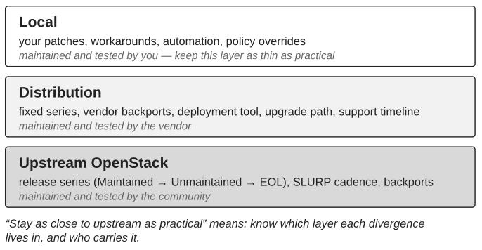

*Part V — Evolving Without Losing Control*

# Chapter 14 — Upgrades, Backports and Upstream Alignment

An OpenStack platform cannot remain unchanged indefinitely. Releases age, security requirements evolve, dependencies stop being maintained, local modifications accumulate, and the cost of standing still eventually becomes part of the risk. An upgrade changes more than software: it changes operating assumptions, dependencies, procedures, recovery methods, monitoring and sometimes the skills the team needs.

A platform that stays reasonably close to upstream OpenStack benefits from community fixes, maintained releases and a body of operational knowledge shared with other operators. Following upstream also reduces the amount of *interpretation* the organization must perform: when engineers investigate behaviour close to upstream, they can rely on community documentation, known defects, release notes and the experience of others, and every local divergence removes some of that common knowledge.

> **Principle.** Stay as close to upstream as practical.

## Vocabulary: maintained, supported, backported

Two words in this discussion are used loosely by operators, and it is worth being precise about them once. A third term, SLURP, is defined in the same note because the maintenance policy depends on it.

> **Technical note — what upstream maintains, and what “backport” means.** Upstream OpenStack does not “support” releases; it *maintains* branches. Since the 2023.1 series, every other release is designated a SLURP release (Skip Level Upgrade Release Process): upgrades are supported between consecutive SLURP releases as well as between adjacent releases, so a deployment can choose to upgrade once a year instead of every six months. A release series is **Maintained** for roughly eighteen months, during which appropriate bug fixes are accepted and point releases are produced. Under the policy in force as this book is written, a SLURP series may then become **Unmaintained**, where fixes can still be merged with reduced CI and no releases as long as community interest exists, while non-SLURP series go directly to **End of Life**, when the branch accepts no further changes. When a series moves to Unmaintained, its `stable/<series>` branch is replaced by an `unmaintained/<series>` branch, which breaks any tooling that pins the old name; at End of Life the branch is deleted and only a tag remains. This policy has changed more than once in recent years and should be checked on releases.openstack.org before it is relied upon. Commercial support, with its own timelines and its own patching, comes from distributions and vendors, not from upstream. In upstream vocabulary a **backport** is a cherry-pick of a fix already merged on the master branch onto an older stable branch, subject to the stable branch policy: low regression risk, user-visible benefit, no new features, no API or schema changes. In this book, unless stated otherwise, *backport* means something broader and more local: a change carried by the deployed platform that is not part of the release it runs, whether it derives from an upstream stable-branch backport, from a later release, or from a purely local fix. The distinction matters because an upstream backport is tested and maintained by the community, whereas a local one is tested and maintained by you. See the OpenStack stable branch policy and the release series status at releases.openstack.org.

## A backport is a risk decision

Staying close to upstream is not a prohibition on local modifications. A backport can be reasonable when a defect must be addressed and a full upgrade would create greater immediate production risk: a stable production release contains a known defect, the fix exists in a newer release, the defect’s impact is bounded, and the upgrade carries significant risk this quarter. The most legitimate case is a security advisory (Chapter 17) whose fix exists upstream but not for the series the platform runs. In that situation a controlled backport can be the right decision. But it is a risk decision, and it should be understood as a local deviation with an owner, an origin, a test and an exit condition. At minimum the organization should know what upstream issue it addresses, which upstream change it derives from, why the full upgrade was not chosen, who owns the local modification, how it is tested and when it should be reconsidered. A backport without an exit condition is a decision the organization has stopped making.

The decision becomes dangerous when backports turn into the lifecycle strategy. Each local modification adds testing, troubleshooting and reconciliation cost, and over time divergence becomes control debt. The question to ask of every backport is what control the organization gains now and what control debt it accepts later. The best time to remove one is usually a planned upgrade: the next maintained release may make it unnecessary, and treating lifecycle events as opportunities to remove local deviations prevents short-term decisions from becoming permanent divergence.

## When a distribution stands between you and upstream

Most mission-critical platforms do not run upstream OpenStack directly. They run a commercial distribution, with a deployment tool, a support contract and a lifecycle of its own, and “stay as close to upstream as practical” needs translating for that reader. The distribution is itself a carried divergence: it fixes the release series, it applies its own backports, and its supported upgrade path may differ from upstream’s SLURP arithmetic, sometimes longer, sometimes constrained to the vendor’s own sequence. None of this contradicts the principle. The vendor’s backports are tested and maintained by the vendor, which is far better than by you alone; the vendor’s support timeline, not upstream’s, is the one that governs when the platform must move; and the local modifications that create control debt are the ones on top of the distribution, not the distribution itself. What the principle asks of the organization is to know where its platform sits in three layers, upstream, distribution and local (Figure 14.1), and to keep the third layer as thin as it can.

The support contract deserves the same scrutiny as any other dependency. Chapter 2 said that a healthy external relationship increases internal capability over time; a vendor relationship should be judged by that test. The organization should be able to say which operations it can perform without opening a ticket, which it cannot, and whether that second list is shrinking. It should expect from every escalation not only a fix but an explanation the team can reuse, and from every engagement a transfer of the operating knowledge involved. A vendor that is the only party able to explain the platform’s behaviour is the control gap of Chapter 2 with a logo on it.

## Upgrade strategy should be continuous

Organizations sometimes treat upgrades as exceptional projects separated by long periods of stagnation; the OpenStack User Survey published by the foundation shows, year after year, production deployments spread across many series, including ones that upstream no longer maintains, so the platform in Chapter 18’s example is not unusual. A healthier approach is to maintain a credible next-state direction at all times. This does not require upgrading constantly. It means understanding the maintenance lifecycle, the platform’s local divergence, its recovery capability and the organization’s readiness early enough that the next upgrade is a planned transition rather than an emergency.

*Figure 14.1: Three layers between the running platform and upstream OpenStack, and who maintains each.*

> **Technical note — what SLURP does and does not promise.** SLURP-to-SLURP upgrades are a commitment made by the OpenStack projects about their own services: the schema migrations and RPC compatibility needed to skip one release are maintained. The promise stops there. The operating system and Python version, the deployment tool, RabbitMQ, MariaDB, the networking backend and the storage backend must each support the same jump, and the online data migrations of the release being skipped must have been completed, or the next schema synchronization refuses to run. A platform more than one SLURP release behind still has to hop through each intermediate SLURP release in sequence. The practical consequence for the decision in Chapter 18 is that “progressive upgrade” and “immediate upgrade” are no longer abstract options: the maintenance status of the current series, whether it is a SLURP release, and the state of the dependencies around it determine how many transitions the platform must make and how much time it has. Always check the current series status on releases.openstack.org before planning; the series list there changes twice a year, and a new SLURP series is added once a year.

## Upgrade readiness is organizational readiness, and it can be measured

Before an upgrade, the organization can review its unresolved local modifications, recovery coverage, test coverage, operational documentation, available capacity, ownership gaps, consumer readiness and monitoring readiness. A weak result does not cancel the upgrade; it identifies where preparation is required. Upstream provides part of the measurement.

> **Technical note — upgrade checks and rolling upgrades.** Several projects ship a pre-upgrade readiness command: `nova-status upgrade check`, `neutron-status upgrade check`, `cinder-status upgrade check` and `placement-status upgrade check` perform release-specific checks before services are restarted with new code, and return a code that indicates whether the upgrade can proceed. Nova documents a rolling upgrade sequence designed to avoid VM downtime: because Nova’s schema migrations are additive, the schema can be synchronized before the maintenance window with the old services still running; Placement is upgraded first; services are restarted with `[upgrade_levels]compute=auto`, which pins RPC to the oldest compute version found, starting with nova-conductor and ending with nova-api; compute nodes are upgraded in batches; once every compute runs the new code the services are sent SIGHUP so that the automatic pin advances (a static pin must instead be removed from the configuration and the services restarted); and online data migrations are completed afterwards with `nova-manage db online_data_migrations`, which is also a hard prerequisite of the *next* upgrade. Since 2023.1, Nova tolerates computes up to two releases older than the control services, which is what makes the SLURP jump possible, and the control services refuse to start if they detect an older one. Other projects follow their own sequences: Neutron’s schema changes are split into expand and contract phases, and the contract phase, although usually empty in recent releases, requires every neutron-server to be stopped. These mechanisms reduce upgrade risk only if the organization knows they exist and rehearses them; they do not remove the need for recovery capability, capacity and ownership. See the Nova upgrade documentation, the Neutron upgrade documentation and the `*-status` command references.

The upgrade is not finished when the new software is deployed. The new state must be observed, verified and transferred into normal operations, and the platform’s previous stability assumptions must be re-earned (Chapter 9). Upgrades also bring changes that are not about software at all: the move to secure default RBAC policies across recent releases (Chapter 17) changed who could do what on many platforms, and an upgrade plan that does not include policy is incomplete. The safest long-term platform is the one whose current state and next state the organization can understand and operate, whether or not it is the newest.

---

[← Chapter 13 — Decision Rights](13-decision-rights.md) · [Contents](../README.md) · [Chapter 15 — Complexity, Technical Debt and Simplification →](15-complexity-technical-debt-and-simplification.md)
