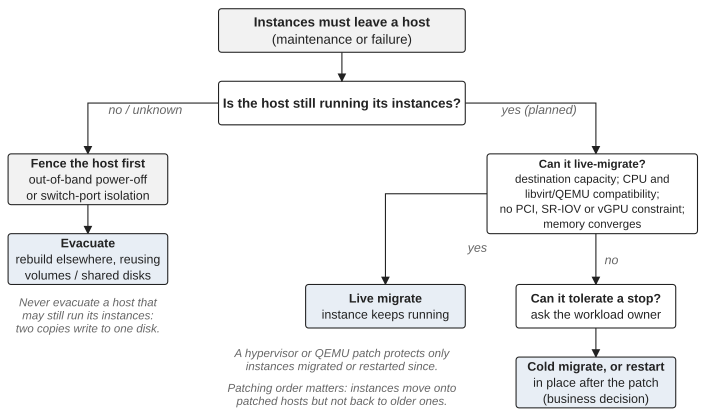

*Part VI — Decisions from the Field*

# Chapter 20 — Security, Capacity and Business Criticality

Security requirements are real. But the execution of a security measure can itself introduce operational risk, and the decision about *how* to meet a requirement is often a business decision that the infrastructure team cannot make alone.

## Context

A production platform of between one and several hundred compute hosts, subject to a mandatory operating-system patching requirement on those hosts. Patching a compute host usually requires rebooting it, and rebooting it without disrupting the instances it runs requires moving them elsewhere first.

## Signal

The platform did not have enough spare compute capacity to live-migrate every workload away from every host before patching it. The constraint was the capacity needed to apply the patch safely, not the patch itself.

> **Technical note — what host maintenance involves.** Taking a compute host out of service for maintenance normally means disabling its `nova-compute` service so that the scheduler places no new instances on it, then moving the instances it runs. Live migration keeps the instance running while it moves; it requires a destination with sufficient CPU, memory and disk, and either shared storage for the instance’s disks or a block migration that copies them across the network, which adds load to both the network and the storage system. It also has compatibility constraints that a patching campaign runs into directly: the destination’s CPU model must be compatible with the source’s, and migration from a newer libvirt/QEMU to an older one is not supported, so once some hosts are patched, instances can move onto them but not back, and the order of patching decides where instances can go. Some instances cannot be live-migrated at all, or should not be: those with PCI passthrough or SR-IOV direct ports, those using a vGPU on versions that do not support mediated-device migration, and memory-intensive workloads whose pages change faster than they can be copied unless auto-converge or post-copy is enabled; for those, a restart is a technical necessity rather than a business choice. Cold migration (`openstack server migrate`), which stops the instance and moves it, is the intermediate option. Evacuation is a different operation, for a host that has already failed, and it must never be used on a host that may still be running its instances (Chapter 10). Finally, a patch to the hypervisor or to QEMU protects only instances that have been migrated or restarted since; an instance that keeps running on the old binary is not patched. See the Nova documentation on configuring and using live migration, on cold migration, and on evacuating instances.

*Figure 20.1: Moving instances off a host: which operation applies, and what must be true first.*

## Uncertainty

What was uncertain was which workloads could tolerate a restart rather than a migration. Nova cannot tell, because it sees instances, not business processes.

## Business risk

Delaying the patching extended the platform’s exposure. Forcing every workload through live migration could not be completed with the capacity available. Restarting workloads without knowing their criticality risked disrupting a business process nobody on the infrastructure team knew about.

## Options

Migrate everything, which the capacity did not allow. Restart everything and accept unknown business impact. Or obtain the missing information from the people who had it, the consuming teams, and execute a differentiated strategy.

## Decision

The consuming teams provided what the infrastructure could not infer: business criticality, acceptable downtime, recovery expectations and deadlines, collected in a shared table that each team filled in for its own workloads. Critical workloads were live-migrated within the capacity available; restarts were coordinated for the workloads that could tolerate them. The security objective did not change. The execution strategy reflected the actual operating environment.

## Trade-off

A differentiated strategy takes longer to plan than a uniform one, and it depends on information that has to be collected from outside the platform team. In exchange, it makes the patching achievable within the capacity that actually exists, and it puts the decision about each workload with the people who know what it does.

## Outcome

The hosts were patched without forcing every workload through a migration the platform could not absorb. The criticality table gathered for the campaign is the kind of input that should exist before a maintenance event rather than be collected for the first time when patching begins; kept up to date, whether as a shared document or as metadata on the instances and projects themselves, it becomes an input to capacity planning rather than a one-off.

## Lesson

Security work is platform work. Patching changes workload placement, capacity and availability, so security requirements have to be integrated with platform capacity planning rather than imposed on operations from outside. If compute capacity is insufficient to migrate every workload, that is a constraint on the organization’s ability to meet security requirements without disruption, and capacity planning should therefore include maintenance scenarios explicitly: how many hosts can be unavailable at once, how many workloads can be in flight, how much spare capacity safe patching requires. The answer depends on the failure domain: a platform that can afford one host down per rack, or per availability zone, needs the spare capacity of one host in each of those domains, not one host overall.

Criticality needs consumer input, and it needs it before the maintenance event. Security risk and availability risk are both business risks, and framing them as a conflict between two technical teams misses the point: the decision is to find the safest achievable balance given the platform’s real state. Recurring difficulty patching hosts, migrating workloads or upgrading dependencies is also evidence of something deeper. The immediate task still has to be completed, but a security operation that consumes disproportionate capacity every time is a lifecycle problem and belongs on the platform roadmap. This is also where security meets upstream alignment: an organization far behind maintained releases eventually faces a choice between repeated local backports and a major upgrade, and while a short-term backport can be rational, a long-term pattern of divergence is lifecycle debt (Chapters 14 and 17).

> **Principle.** Security requirements define what must be achieved. Platform capacity and business criticality determine how safely it can be achieved.

---

[← Chapter 19 — When the Safe Decision Is to Stop](19-when-the-safe-decision-is-to-stop.md) · [Contents](../README.md) · [Conclusion: Keeping OpenStack Under Control →](21-conclusion-keeping-openstack-under-control.md)
